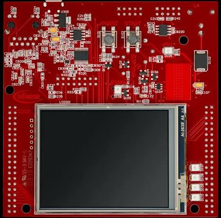
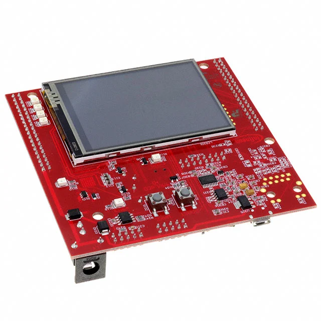

# Application Kit TC234

Projects for the Application Kit TC2X4 (TC234) board.

- Device: **TC23xLP_A-Step** (`DEVICE-ID: TC23A`)
- Platform: **KIT_AURIX_TC234_TFT_AC-Step**
- Debug adapter: **miniWiggler** (DAS-based)
- Serial: **COM6**, chip side **ASC0** (TX P14.0, RX P14.1)

## Projects

| Project         | Description                                                       |
|-----------------|-------------------------------------------------------------------|
| `blink_hello`   | Blinks 4 LEDs (P13.0-P13.3) and prints CPU frequency via ASC0    |
| `dhry_200m`     | Dhrystone 2.1 benchmark @ 200 MHz (GCC -O3), 383k Dhrystone/s    |
| `coremark_200m` | CoreMark 1.0 benchmark @ 200 MHz (GCC -O3), 478.7 it/s           |
| `pwm_buzz_test` | Passive buzzer on P33.0, 2048 Hz PWM, duty sweep 0-100-0          |

### blink_hello

- LEDs on P13.0 ... P13.3, low active (set pin low to turn LED on).
- Blink pattern rotates every 200 ms per LED.
- Serial on **COM6**, ASC0: TX **P14.0**, RX **P14.1**, **115200 baud** (8N1).
- Prints `hello blink CPU=... SPB=... MHz Die=... C` every 2 seconds.
- The **Die Temperature Sensor (DTS)** is read and printed each report
  (typical ~36 °C at room temperature).

### Die Temperature Sensor (DTS)

All projects read and print the on-die temperature via the iLLD DTS driver
(`dts.c/h` wrapping `IfxDts_Dts`):

- `start_dts_measure()` initialises the DTS module (polling mode, no ISR) and
  triggers a measurement.
- `read_dts_celsius()` waits for the conversion and returns degrees Celsius.
- Verified on TC234: **~36 °C** at room temperature.

## Toolchain options

### TASKING (AURIX Studio IDE)

The project is configured for the **TASKING VX-toolset** in its `.cproject`.
The free ADS edition only runs the compiler when spawned **by the IDE** —
building from the command line fails with
`License does not support running as standalone`. Use the IDE GUI build.

### GCC (standalone CLI, no license restriction)

All three tested AURIX GCC toolchains work standalone:

| Toolchain                                                     | Version  |
|---------------------------------------------------------------|----------|
| `D:\aurixgcc_03_2026\bin\tricore-elf-gcc.exe`                | 11.3.1   |
| `D:\Infineon\AURIX-Configuration-Studio-1.0.20\...\tricore-gcc11\bin\...` | 11.3.1 |
| `D:\Infineon\AURIX-Studio-1.10.36\tools\Compilers\tricore-gcc11\bin\...` | 11.3.1 |

CPU selection uses `-mcpu=tc23xx` (note the two trailing `x`).

## Building from the CLI (GCC)

Run the project's build script:

```
powershell -ExecutionPolicy Bypass -File appkit-tc234\blink_hello\build_blink_hello.ps1
```

It compiles all `Libraries/` sources + project sources and links with the GCC
linker script, producing `blink_hello.hex` in `%TEMP%\blink_hello_build\`.

Important build details (documented, do not regress):

1. **GCC linker script** `Lcf_Gnuc_Tricore_Tc.lsl` must be present in the
   project root. It was copied from the AURIX Studio bundled artefacts:
   ```
   <ADS>\build_system\bundled-artefacts-repo\project-initializer\tricore-tc2xx\1.11-12\Linker_conf\GnuC\TC23A\Lcf_Gnuc_Tricore_Tc.lsl
   ```
2. **Defines**: `-D__HIGHTEC__` (selects `CompilerGnuc.h` / HighTec-style GCC
   startup), `-D__TRICORE__`.
   Do **NOT** define `IFX_CFG_USE_COMPILER_DEFAULT_LINKER` — it disables the
   iLLD startup code `IfxCpu_CStart0.c` (the `_START`/`_Core0_start` symbols),
   producing an empty start section.
3. The TASKING `.lsl` (`Lcf_Tasking_Tricore_Tc.lsl`) is TASKING-specific and
   cannot be used with GCC.
4. **Linker script fix**: newlib's `sbrk` needs the `end` symbol, which the
   stock script does not define. `PROVIDE(end = __HEAP_END);` was added after
   the `.heap` section.
5. **`abort()` stub**: newlib's `libc.a` in this toolchain does not provide
   `abort`, but the CStart error path references it. The project includes
   `abort_stub.c` which loops on a `debug` trap.
6. **Link order**: `-lgcc` must appear both before and after `-lc` so the
   soft-float double helpers (`__divdf3`, `__unorddf2`, etc.) used by newlib's
   `vsprintf` resolve.
7. The AURIXFlasher ships its own `tricore-objcopy.exe` (used to produce hex in
   the IDE); the standalone GCC toolchain provides `tricore-elf-objcopy.exe`.

## Flashing from the CLI

The miniWiggler is supported via the AURIX Flasher CLI tool (DAS-based),
shipped inside AURIX Studio:

```
"D:\Infineon\AURIX-Studio-1.10.36\tools\AurixFlasherSoftwareTool_v3.0.18\AURIXFlasher.exe" ^
    -hex <path-to>.hex -prog on -ver on -start on
```

- `-prog on`: enable programming (erase + write).
- `-ver on`: verify after write.
- `-start on`: reset the device at the end (release CPU halt).
- The tool auto-detects the connected TC23x device over the miniWiggler and
  returns exit code 0 on success. `TC23x_A_step.json` is the matching device
  config.
- Caveat: connecting with the flasher leaves the CPU **halted** unless
  `-start on` (or a later `-start on` run) is used. The earlier shell probe
  used `-start off`, which is why the board appeared dead until re-flashed or
  USB re-plugged.

## Known pitfalls

- If the serial terminal shows garbage like `�a�a`, the terminal baud does not
  match the firmware (firmware prints at 115200; a "clean" letter is usually
  the terminal's own local echo, not the MCU). Unplug/replug USB to get a clean
  console after a flash session, and verify the baud setting in the terminal.
- ASC0 baud is derived from the SPB clock via `IfxScuCcu_getSpbFrequency()`.
  The clock config in `Configurations/Ifx_Cfg.h` (XTAL 20 MHz, PLL 200 MHz)
  must match the board.
- LED blink period is 200 ms by design; the "2 s" applies to the serial report
  only.

## Board




## How to add projects

Copy a project folder from `../appkit-tc275/` (e.g. `shell`) into this
directory, then:

1. Rename the folder to the desired project name (folder name must equal the
   Eclipse project name).
2. Edit `<name>` in the `.project` file.
3. Replace the build path references in `.cproject`:
   - `${workspace_loc:/<oldName>}/Debug`
   - `${workspace_loc:/<oldName>}/Release`
4. Update board-specific settings in `.exportedSettings` and
   `.settings/com.infineon.aurix.buildsystem.prefs`:
   - `aurixDevice` / `DEVICE-ID-FULL` / `DEVICE-ID` (e.g. TC23x family)
   - `aurixPlatform` (e.g. KIT_AURIX_TC234)
5. Replace the `Libraries/` folder with the matching iLLD set for the new
   device, and swap the linker script (`Lcf_Tasking_Tricore_Tc.lsl`).
6. Import the project into AURIX Studio.
