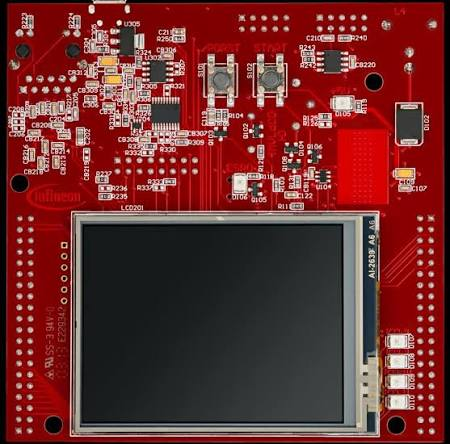
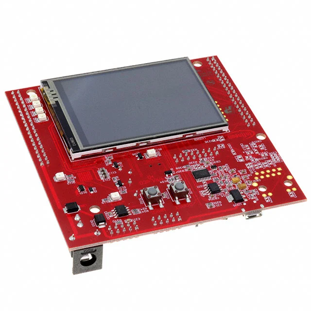

# Application Kit TC234

Projects for the Application Kit TC2X4 (TC234) board.

- Device: **TC23xLP_A-Step** (`DEVICE-ID: TC23A`)
- Platform: **KIT_AURIX_TC234_TFT_AC-Step**
- Debug adapter: **miniWiggler** (DAS-based)
- Serial: **COM6**, chip side **ASC0** (TX P14.0, RX P14.1)

## Projects

All bare-metal projects live in the `bare/` folder.

| Project                  | Description                                                       |
|--------------------------|-------------------------------------------------------------------|
| `bare/blink_hello`       | Blinks 4 LEDs (P13.0-P13.3) and prints CPU frequency via ASC0    |
| `bare/dhry_200m`         | Dhrystone 2.1 @ 200 MHz: 394.5k Dhrystones/s (1.12 DMIPS/MHz)    |
| `bare/coremark_200m`     | CoreMark 1.0 @ 200 MHz: 490.9 it/s                               |
| `bare/pwm_buzz_test`     | Passive buzzer on P33.0, 2048 Hz PWM, duty sweep 0-100-0          |
| `bare/nv3030b_md183_240x284_cst816d` | TK018F3716 240x284 NV3030B LCD (QSPI2) + CST816D touch (soft I2C) |

All projects run at **CPU = 200 MHz / SPB = 100 MHz** (PLL from the 20 MHz
XTAL, see "Clock configuration" below).

The LCD/touch project wires the panel CS to **P15.2** (GPIO software CS) and
uses QSPI2 on **SCLK P15.6 / MOSI P15.5**; touch is bit-banged I2C on
**P02.0/P02.1**. See its own `README.md` for the transport details and the
bug notes.

### blink_hello

- LEDs on P13.0 ... P13.3, low active (set pin low to turn LED on).
- Blink pattern rotates every 200 ms per LED.
- Serial on **COM6**, ASC0: TX **P14.0**, RX **P14.1**, **115200 baud** (8N1).
- Prints `hello blink CPU=... SPB=... MHz Die=... C` every 2 seconds.
- The **Die Temperature Sensor (DTS)** is read and printed each report
  (typical ~36 °C at room temperature).

### Die Temperature Sensor (DTS)

All projects read and print the on-die temperature via the iLLD DTS driver
(`dts.c/h` wrapping `IfxDts_Dts`):

- `start_dts_measure()` initialises the DTS module (polling mode, no ISR) and
  triggers a measurement.
- `read_dts_celsius()` waits for the conversion and returns degrees Celsius.
- Verified on TC234: **~36 °C** at room temperature.

## Toolchain options

### TASKING (AURIX Studio IDE)

The project is configured for the **TASKING VX-toolset** in its `.cproject`.
The free ADS edition only runs the compiler when spawned **by the IDE** —
building from the command line fails with
`License does not support running as standalone`. Use the IDE GUI build.

### GCC (standalone CLI, no license restriction)

This repository is built with the **AURIX GCC 11.3.1** toolchain
(`tricore-elf-gcc`).

Get the toolchain from an official source:

- **Bundled with AURIX Development Studio / AURIX Configuration Studio** —
  the `tricore-gcc11` compiler ships inside the IDE install.
- **Official download** — see the Infineon AURIX Development Studio / AURIX
  GCC downloads (search "AURIX tricore-elf-gcc" on
  [Infineon Developer Community](https://community.infineon.com/) or the
  Infineon software download portal).

Add the toolchain's `bin/` directory to `PATH`, then run `make` in a project
folder as shown below.

CPU selection uses `-mcpu=tc23xx` (note the two trailing `x`).

## Building from the CLI (GCC)

Each project ships a **Makefile** (GNU Make, incremental with header deps).
Run from MSYS2 (`C:\msys64\usr\bin\bash.exe`) or Git Bash:

```
cd appkit-tc234/bare/<project>
make          # link build/<proj>.elf
make hex      # build build/<proj>.hex
make flash    # program build/<proj>.hex via AURIXFlasher (rebuilds hex first)
make size     # print section sizes
make clean    # remove build/
```

Set `TRICORE_GCC` to the full compiler path if `tricore-elf-gcc` is not on
`PATH`; override the flasher with `make flash AURIX_FLASHER=...`.

### Shared Libraries

The iLLD `Libraries/` folder is **shared at the board root**
(`appkit-tc234/Libraries`) — all projects reference the same copy, so there is
no duplication. The Makefiles resolve it directly, so a fresh clone works out
of the box.

If you open the projects in the AURIX Studio IDE (whose `.cproject` expects
`Libraries` inside each project via `${ProjDirPath}/Libraries`), recreate the
per-project links once:

```
bash appkit-tc234/setup_libraries_links.sh   # symlinks on POSIX, junctions on Windows
```

This creates `bare\blink_hello\Libraries`, `bare\dhry_200m\Libraries`, etc. as
links to `appkit-tc234\Libraries`. They are not tracked by git; re-run the
script after a fresh clone.

Important build details (documented, do not regress):

1. **GCC linker script** `Lcf_Gnuc_Tricore_Tc.lsl` must be present in the
   project root. It was copied from the AURIX Studio bundled artefacts:
   ```
   <ADS>\build_system\bundled-artefacts-repo\project-initializer\tricore-tc2xx\1.11-12\Linker_conf\GnuC\TC23A\Lcf_Gnuc_Tricore_Tc.lsl
   ```
2. **Defines**: `-D__HIGHTEC__` (selects `CompilerGnuc.h` / HighTec-style GCC
   startup), `-D__TRICORE__`.
   Do **NOT** define `IFX_CFG_USE_COMPILER_DEFAULT_LINKER` — it disables the
   iLLD startup code `IfxCpu_CStart0.c` (the `_START`/`_Core0_start` symbols),
   producing an empty start section.
3. The TASKING `.lsl` (`Lcf_Tasking_Tricore_Tc.lsl`) is TASKING-specific and
   cannot be used with GCC.
4. **Linker script fix**: newlib's `sbrk` needs the `end` symbol, which the
   stock script does not define. `PROVIDE(end = __HEAP_END);` was added after
   the `.heap` section.
5. **`abort()` stub**: newlib's `libc.a` in this toolchain does not provide
   `abort`, but the CStart error path references it. The project includes
   `abort_stub.c` which loops on a `debug` trap.
6. **Link order**: `-lgcc` must appear both before and after `-lc` so the
   soft-float double helpers (`__divdf3`, `__unorddf2`, etc.) used by newlib's
   `vsprintf` resolve.
7. The AURIXFlasher ships its own `tricore-objcopy.exe` (used to produce hex in
   the IDE); the standalone GCC toolchain provides `tricore-elf-objcopy.exe`.

## Flashing from the CLI

The miniWiggler is supported via the AURIX Flasher CLI tool (DAS-based),
shipped inside AURIX Studio:

```
"D:\Infineon\AURIX-Studio-1.10.36\tools\AurixFlasherSoftwareTool_v3.0.18\AURIXFlasher.exe" ^
    -hex <path-to>.hex -prog on -ver on -start on
```

- `-prog on`: enable programming (erase + write).
- `-ver on`: verify after write.
- `-start on`: reset the device at the end (release CPU halt).
- The tool auto-detects the connected TC23x device over the miniWiggler and
  returns exit code 0 on success. `TC23x_A_step.json` is the matching device
  config.
- Caveat: connecting with the flasher leaves the CPU **halted** unless
  `-start on` (or a later `-start on` run) is used. The earlier shell probe
  used `-start off`, which is why the board appeared dead until re-flashed or
  USB re-plugged.

## Clock configuration

The board runs from the on-board 20 MHz crystal with the PLL configured for
**200 MHz** (`Configurations/Ifx_Cfg.h`: `IFX_CFG_SCU_XTAL_FREQUENCY` 20 MHz,
`IFX_CFG_SCU_PLL_FREQUENCY` 200 MHz). The matching iLLD PLL step table is
`IFXSCU_CFG_PLL_STEPS_20MHZ_200MHZ` (K2 = 5 / 4 / 3), selected automatically
from those two macros.

The clock is brought up by the standard iLLD hook in
`Libraries/iLLD/TC23A/Tricore/Cpu/CStart/IfxCpu_CStart0.c`:

```c
#define IFXCPU_CSTART_CCU_INIT_HOOK() (void)IfxScuCcu_init(&IfxScuCcu_defaultClockConfig)
```

Two historical boot problems on this kit are fixed in that file and must not
be reverted:

1. **ESR0/ESR1 reset outputs** — `_START()` drives `SCU_OMR.PCL0/PCL1` high.
   Left in their post-reset state they interact with the kit's reset
   circuitry.
2. **Clock init** — the hook above must stay enabled. It was once replaced by
   a no-op (the PLL was believed dead), which silently left the chip on the
   100 MHz backup clock. With fix (1) in place the PLL works and the chip runs
   at the configured 200 MHz.

Verify with `blink_hello`: it prints `CPU=200.00 MHz SPB=100.00 MHz`.

## Known pitfalls

- If the serial terminal shows garbage like `�a�a`, the terminal baud does not
  match the firmware (firmware prints at 115200; a "clean" letter is usually
  the terminal's own local echo, not the MCU). Unplug/replug USB to get a clean
  console after a flash session, and verify the baud setting in the terminal.
- ASC0 baud is derived from the SPB clock via `IfxScuCcu_getSpbFrequency()`,
  so it follows the clock configuration automatically.
- **UART software-FIFO buffers must be 4-byte aligned.** `serial.c` declares
  `g_uartTxBuffer` / `g_uartRxBuffer` as `uint8[]` and `Ifx_Fifo_init()` casts
  them to `Ifx_Fifo *`; the FIFO code performs 32-bit accesses at struct
  offsets 0/4/12. Without `__attribute__((aligned(4)))` the linker may place
  them 2-byte aligned, and at higher optimisation levels (`-Ofast`) the
  resulting wide access raises an **instruction-error trap (class 2, tin 4 =
  data address alignment)**. The iLLD trap handler ends in `__debug()`, so the
  CPU silently parks and the serial output just stops mid-message. Keep the
  alignment attribute on any new UART buffer.
- LED blink period is 200 ms by design; the "2 s" applies to the serial report
  only.

## LCD/touch porting checklist (nv3030b bring-up lessons)

Full story in `bare/nv3030b_md183_240x284_cst816d/README.md` ("Bugs found and
fixed"). The generalizable traps, all hit during that bring-up:

- **`CS_SET` / `CS_CLR` are functions, not macros.** A `CS_SET;` statement
  (macro-style, no parens) compiles with only a `-Wall` "statement with no
  effect" warning — CS never asserts and the panel ignores every byte while
  the code "sends" normally. Always call them: `CS_SET();`.
- **`WriteComm()` must copy the wrapped-command prefix (`02 00 <cmd> 00`)
  into the driver's TX buffer** before flushing. Dropping the copy leaves
  `s_tx_len == 0`, and the first burst waits forever on an end-of-frame
  event that never comes (keep that wait bounded + print a diagnostic).
- **`Bsp.h`'s `now()` returns raw STM ticks, not ms.** Divide by the STM
  frequency before using it as a millisecond timestamp.
- **Soft-I2C reads: restore SDA to output mode before driving the master
  ACK.** With SDA left in input mode the ACK never reaches the slave and
  every register read returns `0xFF` after the first byte.
- **Size `GLOBALCON.TQ` from the fastest rate you will request.** The QSPI
  time quanta (`fMAX / (TQ + 1)`) is the base for all channel dividers; a
  coarse quantum silently clamps every higher request (observed: "set
  50000 kHz → real 10000 kHz" for nine consecutive ladder steps).

## Board




## How to add a project

All builds and flashing are done from the command line; there is no need to
import anything into an IDE.

Copy an existing project folder in this board directory (e.g. `blink_hello`)
to a new name, then:

1. Rename the folder to the desired project name (e.g. `my_app`).
2. Edit the sources in the new folder (e.g. `Cpu0_Main.c`) to implement your
   application.
3. Copy the Makefile from an existing project and change `PROJ :=` to the new
   project name (`my_app`). The Makefile compiles all sources from
   `../Libraries/` plus the project sources with
   `tricore-elf-gcc -mcpu=tc23xx -D__HIGHTEC__ -D__TRICORE__` and the include
   paths from `.cproject`, links with the GCC linker script
   `Lcf_Gnuc_Tricore_Tc.lsl` and `-lgcc -lc -lnosys`, and produces
   `build/<proj>.hex`.
4. Flash the `.hex` with `AURIXFlasher.exe` (`make flash`, see "Flashing from
   the CLI").

The `.cproject`, `.project`, `.exportedSettings` and `.settings` files only
matter for the optional AURIX Studio IDE import (and the shared-Libraries
junctions in that case). For the CLI workflow they are not used.
