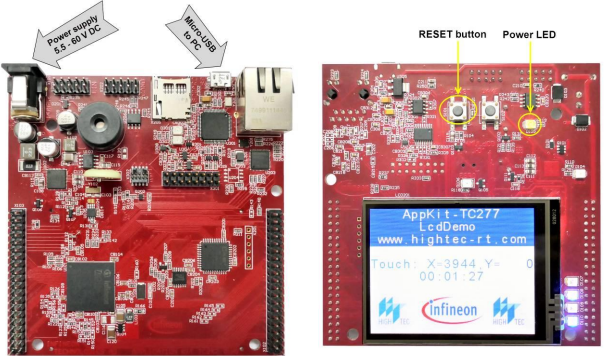
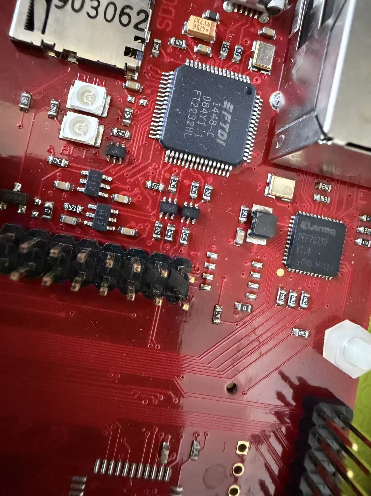
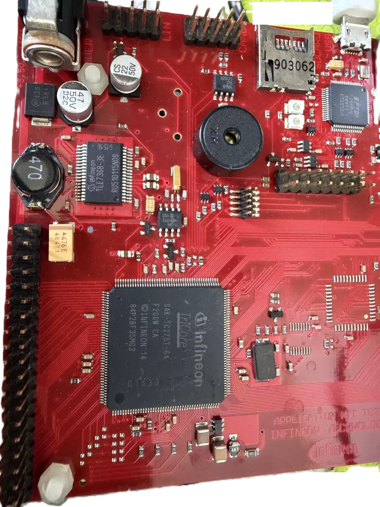

# Application Kit TC275 (TC2X5 V2.0)

Projects for the **Application Kit TC2X5 V2.0** board (TC275).

## Projects

| Project   | Description                          |
|-----------|--------------------------------------|
| `shell`   | ASCLIN shell over UART (921600 baud) |
| `coremark`| CoreMark benchmark                   |
| `dhry`    | Dhrystone benchmark                  |

Each project builds inside AURIX Development Studio (TASKING compiler).

> **Note:** These projects have only been tested with the **TASKING** toolchain
> (the `Libraries/` iLLD set, linker script `Lcf_Tasking_Tricore_Tc.lsl`, and
> `.cproject` are all TASKING-configured). They are not validated with the GCC
> toolchain — the `.cproject` contains no GCC configuration and the project has
> no GCC linker script. Building with GCC would require the additional
> setup described in `../appkit-tc234/README.md` (GCC linker script, `-D__HIGHTEC__`,
> `abort` stub, etc.) plus replacing the TC27D iLLD set with the matching one.

## Board

## Flasher

Flasher JSON for the in-IDE flasher lives in `doc/`. If the original
`TC27x_D_step.json` does not support the non-D Step, first add the JTAG IDs in
the file.
