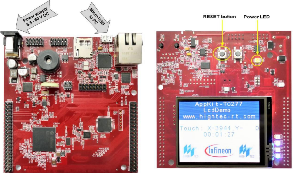
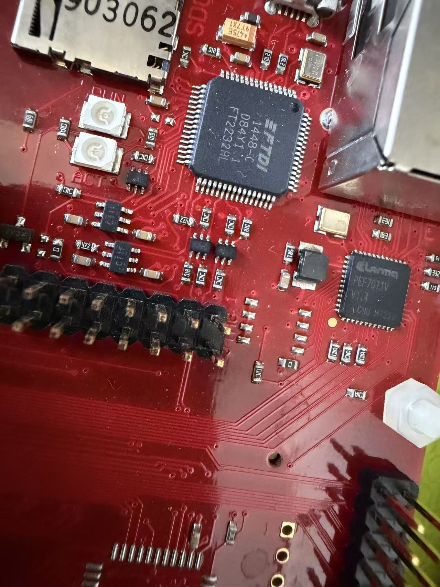
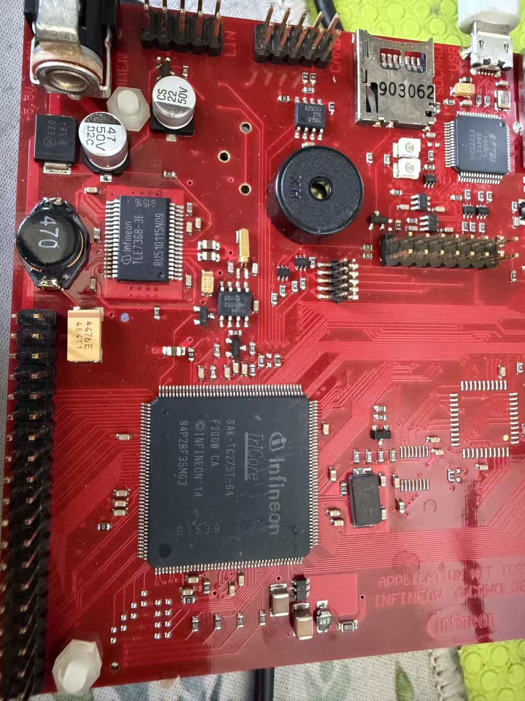
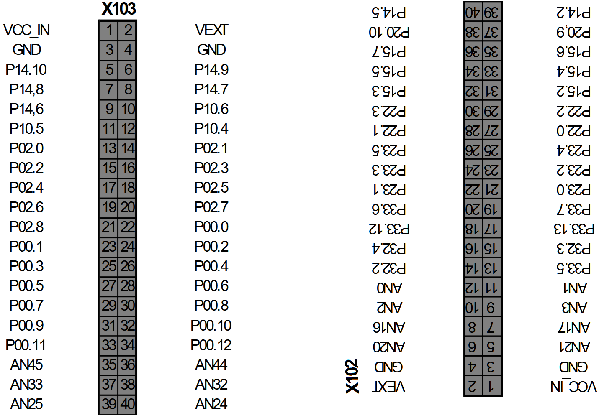

# Application Kit TC275 (TC2X5 V2.0)

Projects for the **Application Kit TC2X5 V2.0** board (TC275).

- Device: **TC27xTP C-Step** (`DEVICE-ID: TC27x`, CHIPID `70` = 'C'), TriCore
  1.6.2, **3 cores** (CPU0/CPU1/CPU2), max 200 MHz
- Platform: **KIT_AURIX_TC275_TFT** (Application Kit TC2x5 V2.0)
- Debug adapter: onboard **miniWiggler** (Infineon DAS JDS, DAP/JTAG)
- Serial: **COM6**, chip side **ASC0** (TX P14.0, RX P14.1), **115200 baud** (8N1)

## Projects

| Project                     | Description                                           |
|-----------------------------|-------------------------------------------------------|
| `bare/blink_hello`          | ASCLIN UART banner + Die-Temp + 4-LED blink (3 cores) |
| `bare/coremark_200m`        | CoreMark 1.0 benchmark, runs on all 3 cores           |
| `bare/dhry_200m`            | Dhrystone 2.1 benchmark, runs on all 3 cores          |
| `bare/st7789s_md120_240x240_ft6336` | TK012F6 240x240 touch LCD (ST7789S via QSPI2 + FT6336 via I2C0) |

All projects are **bare metal** (no RTOS), hence the `bare/` folder. The
`_200m` suffix reflects the board's maximum core frequency (200 MHz).

The benchmark projects run the benchmark on each core in turn using a shared
token (`g_activeCoreToken`) and report results over the UART.

## Benchmark results (200 MHz, GCC -Ofast)

The benchmark Makefiles use the same `arm-none-eabi-gcc` optimization flags as
the STM32U575 `nucleo-u575` reference projects (`bare/dhry_200m`:
`-Ofast -ffp-contract=fast -funroll-loops`, `bare/coremark_200m`:
`-Ofast -ffp-contract=fast -funroll-all-loops`).

### CoreMark 1.0 (8000 iterations, 2K run, static)

| Core | TASKING -O3 | GCC -O3 | GCC -Ofast (current) |
|------|----------|---------|---------|
| CPU0 | 248.5    | 299.6   | **300.7** (26.61 s) |
| CPU1 | 417.1    | 510.8   | **511.5** (15.64 s) |
| CPU2 | 262.5    | 329.3   | **348.3** (22.97 s) |

The TASKING numbers are from the original in-IDE runs. The GCC -O3 numbers were
the previous CLI measurements; the current -Ofast numbers were re-measured on
this board at 200 MHz, all runs validated (`crcfinal 0x5275`, "Correct
operation validated"). See `bare/coremark_200m/README.md`.

### Dhrystone 2.1 (2,000,000 runs)

| Core | TASKING -O3 | GCC -Ofast (current) |
|------|----------|---------|
| CPU0 | 183318   | **205128** (0.584 DMIPS/MHz) |
| CPU1 | 333890   | **315457** (0.898 DMIPS/MHz) |
| CPU2 | 245700   | **276243** (0.786 DMIPS/MHz) |

The Dhrystone results with the new -Ofast flags are identical to the previous
GCC -O3 measurements (integer workload, unaffected by the FP-related flag
delta). See `bare/dhry_200m/README.md`.

## Toolchain options

### TASKING (AURIX Studio IDE)

The projects were originally created for the **TASKING VX-toolset** in their
`.cproject` (processor `tc27xd`). The free ADS edition only runs the compiler
when spawned **by the IDE** — building from the command line fails with
`License does not support running as standalone`. Use the IDE GUI build.

### GCC (standalone CLI, no license restriction)

The projects also build from the command line with the **AURIX GCC 11.3.1**
toolchain (`tricore-elf-gcc`, `-mcpu=tc27xx`), following the same pattern as
`appkit-tc234` and `tc212-kit`.

Each project ships a **Makefile** (GNU Make, incremental with header deps).
Run from MSYS2 (`C:\msys64\usr\bin\bash.exe`) or Git Bash:

```
cd appkit-tc275/bare/<project>
make          # link build/<proj>.elf
make hex      # build build/<proj>.hex
make flash    # program build/<proj>.hex (rebuilds hex first if missing)
make size     # print section sizes
make clean    # remove build/
```

Set `TRICORE_GCC` to the full compiler path if `tricore-elf-gcc` is not on
`PATH`; override the flasher with `make flash AURIX_FLASHER=...`.

### Shared Libraries

The iLLD `Libraries/` folder is **shared at the board root**
(`appkit-tc275/Libraries`) — all projects reference the same copy, so there is
no duplication. The build resolves it directly, so a fresh clone works out of
the box.

If you open the projects in the AURIX Studio IDE (whose `.cproject` expects
`Libraries` inside each project via `${ProjDirPath}/Libraries`), recreate the
per-project links once:

```
bash appkit-tc275/setup_libraries_links.sh   # symlinks on POSIX, junctions on Windows
```

This creates `bare\blink_hello\Libraries`, `bare\coremark_200m\Libraries`,
`bare\dhry_200m\Libraries`,
`bare\st7789s_md120_240x240_ft6336\Libraries`
as links to `appkit-tc275\Libraries`. They are not tracked by git; re-run the
script after a fresh clone.

Important build details (documented, do not regress):

1. **GCC linker script** `Lcf_Gnuc_Tricore_Tc.lsl` was copied from the AURIX
   Studio bundled artefacts (`Linker_conf/GnuC/TC27D`) and extended with
   `PROVIDE(end = __HEAP_END);` (newlib `sbrk` needs the `end` symbol).
2. **Defines**: `-D__HIGHTEC__` (selects `CompilerGnuc.h` / HighTec-style GCC
   startup), `-D__TRICORE__`.
3. **Multicore**: all three cores start from one ELF — CPU0 runs `_START` at
   the reset vector and starts CPU1/CPU2 via `IfxCpu_startCore()`.
4. **Shared token**: `g_activeCoreToken` must be in a **globally-addressable
   RAM**. Placing it in LMU (`.bss_lmu` at `0x90000000`) breaks the startup of
   cores 1/2 in GCC builds (they never start). The GCC build places it in the
   default `.bss` (dsram1 at `0x60000000`, globally aliased), which works;
   TASKING keeps its original `#pragma section farbss "lmu_sram"` placement.
5. **`abort()` stub**: newlib's `libc.a` does not provide `abort`, but the
   CStart error path references it. Each project includes `abort_stub.c`.
6. **Link order**: `-lgcc` must appear both before and after `-lc` so the
   soft-float double helpers (`__divdf3`, `__unorddf2`, etc.) used by newlib's
   `vsprintf` resolve.
7. **`-ffunction-sections -fdata-sections`** are used so `--gc-sections` can
   drop unused code — the image must stay below the BMHD1 boundary at
   `0x80020000`.
8. **CoreMark CRC**: the GCC TriCore backend pattern-matches the bitwise CRC
   loop in `core_util.c` into `crcn`/`shuffle` instructions that its own
   assembler rejects (`Opcode/operand mismatch`). A `volatile` local in
   `crcu8()` forces real memory ops (same fix as `appkit-tc234`).
9. **CoreMark `static_memblk` alignment**: `static_memblk` is a byte array so
   GCC places it unaligned, and CoreMark's 32-bit accesses trap. It must be
   `__attribute__((aligned(8)))` (TASKING's `__align(8)`).

## Flashing from the CLI

The onboard miniWiggler is supported via the AURIX Flasher CLI tool (DAS-based),
shipped inside AURIX Studio:

```
"D:\Infineon\AURIX-Studio-1.10.36\tools\AurixFlasherSoftwareTool_v3.0.18\AURIXFlasher.exe" ^
    -hex <path-to>.hex -prog on -ver on -start on
```

- `-prog on`: enable programming (erase + write).
- `-ver on`: verify after write.
- `-start on`: reset the device at the end (release CPU halt).
- The tool auto-detects the connected TC27x device over the miniWiggler.
  `doc/TC27x_D_step.json` is the matching device config for the in-IDE
  flasher (note: this board is a **C-step** chip; the config's JTAGID was
  extended to cover it).
- Caveat: connecting with the flasher leaves the CPU **halted** unless
  `-start on` (or a later `-start on` run) is used.
- Caveat: after a long flash session the virtual COM may go silent. Unplug /
  replug the board's USB to restore it.

## Serial console

Open the miniWiggler's virtual COM port (e.g. **COM6**) at **115200 baud 8N1**
after flashing. All projects print their banner/benchmark results there.

## Board





