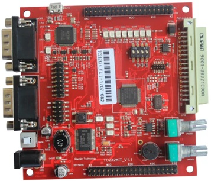

# tc212-kit

Projects for the **TC212 Application Kit** (TC22x family, AURIX 1G).



- Device: **TC21x/TC22x** (`DEVICE-ID: TC22x` family)
- Verified silicon CHIPID: `CHID=12 CHREV=1 FSIZE=1` (**TC212, 512 KB program flash**)
- Core: TriCore 1.6.1 (uses `-mcpu=tc22xx`)
- Max CPU frequency: **133 MHz** (datasheet)
- Program flash: **512 KB** (0x80000000-0x80080000), DSPR: **48 KB** (0x70000000)
- No LMU / EDmem on TC212 (linker script removed those regions)
- Debug: miniWiggler (DAS), **TC2_JTAG**
- Serial: **ASC0** on P15.2 (TX) / P15.3 (RX), 115200 8N1

## Projects

| Project         | Description                                                        | Build tool            | Result |
|-----------------|--------------------------------------------------------------------|-----------------------|--------|
| `blink_hello`   | 8 LEDs, CPU/die temp + **AN18 ADC** via ASC0                      | `make`                | boot OK @133.33 MHz, ~39 C die, AN18=2.556 V |
| `dhry_133m`     | Dhrystone 2.1 benchmark (core0)                                    | `make`                | **263,505 Dhrystones/s**, 1.128 DMIPS/MHz @ -O3 |
| `coremark_133m` | CoreMark 1.0 benchmark (core0)                                     | `make`                | **322.9 CoreMark** (2.42 CoreMark/MHz) @ -O3 |
| `pwm_buzz_test` | Passive buzzer on **P10.5** (GTM TOM0_CH2), 2048 Hz PWM duty sweep | `make`                | boot + banner OK (audible sweep) |
| `spi_ee_test`   | **AT25128N** SPI EEPROM (P33.5/P20.11/P20.14/P20.12) erase/program/read speed test | `make`          | verify OK: write ~29 KB/s, read ~0.23 MB/s |

The benchmark projects (`dhry_133m`, `coremark_133m`) build with
`-O3 -ffast-math -funroll-loops -finline-functions -fno-math-errno`, matching
the appkit-tc234 benchmark builds. Non-benchmark projects use `-O1`.

## Shared Libraries

The iLLD `Libraries/` folder is shared at the board root (`tc212-kit/Libraries`),
extracted from the **TC22A iLLD 1.20.0** package bundled in AURIX Studio
(`iLLD_1_20_0__TC22A.zip`). It is the same iLLD generation as `appkit-tc234`
(the register base addresses are identical to the TC212 for all shared modules).
The TC212's own memory map is used via each project's linker script
`Lcf_Gnuc_Tricore_Tc.lsl`.

## Serial port (host)

The TC212 miniWiggler is a **combined device**: one USB exposes both the
debugger (DAP/JTAG) and a **virtual serial port** for the target UART (printf
style). Open the virtual COM at **115200 8N1**.

UART wiring (FT2232HL Channel B):
- **BDBUS1 (TXD) -> P15.2** - MCU TX (ASC0 ATX0)
- **BDBUS0 (RXD) -> P15.3** - MCU RX (ASC0 ARX0B)

The alternate P14.0/P14.1 paths have `0R_DNA` (do-not-assemble) resistors and
are not populated. **Combo 1 (P15.2/P15.3) is the correct wiring.**

## Build

Each project has a `Makefile` (GNU Make, AURIX GCC `tricore-elf-gcc`,
`-mcpu=tc22xx`). Run from a bash shell (MSYS2 `C:\msys64\usr\bin\bash.exe`
preferred, else Git for Windows bash). `TRICORE_GCC` defaults to
`D:/aurixgcc_03_2026/bin/tricore-elf-gcc`; override it (or set the toolchain on
PATH) if your install differs.

**Generic workflow** — `cd` into any project folder and use the make targets:

```
cd tc212-kit/<any-project>
make hex      # build build/<proj>.hex
make flash    # program build/<proj>.hex via AURIXFlasher
```

Targets:

| Target       | Action                                              |
|--------------|-----------------------------------------------------|
| `make`       | build `<proj>.hex` (same as `make hex`)             |
| `make hex`   | build `<proj>.hex`                                  |
| `make flash` | program `<proj>.hex` via AURIXFlasher               |
| `make size`  | print section sizes                                 |
| `make clean` | remove `build/`                                     |

Header dependencies are tracked via `-MMD -MP`, so touching a header
automatically rebuilds the affected objects.

Outputs stay in the project folder: `<project>/build/<proj>.hex` (plus
`.elf`/`.map`/objects). These are ignored via the repo `.gitignore`
(`build/`, `*.hex`, `*.elf`, `*.map`, `*.o`).

## Flash

`make flash` programs the project-local hex (defaults to the AURIX Studio
flasher; set `AURIX_FLASHER` to override). From any project folder:

```
cd tc212-kit/<any-project> && make flash
```

Equivalent direct command (run from the project folder):

```
"D:\Infineon\AURIX-Studio-1.10.36\tools\AurixFlasherSoftwareTool_v3.0.18\AURIXFlasher.exe" ^
    -hex build\<proj>.hex -prog on -ver on -start on
```

The tool auto-detects the connected TC21x device and reports `Pass` on success.

## Notes / gotchas

- **TC212 has only 512 KB flash and 48 KB DSPR.** The bundled TC2xx linker
  defaulted to 1 MB flash (LCF_INTVEC0_START=0x800F4000) which overflowed.
  The corrected `Lcf_Gnuc_Tricore_Tc.lsl` uses 0x80070000 for the interrupt
  table, 48 KB DSPR, and removes the LMU/EDmem regions (TC212 has none).
- TC212 has no LMU, so the CStart SDA4 init needs `__A9_MEM` defined; it is
  aliased to `_SMALL_DATA3_` (A8 base) in the linker script.
- The older iLLD CStart references `_init()`, which newer GCC does not link
  with `-nostdlib`; `abort_stub.c` provides empty `_init`/`_fini` stubs.
- The `end` symbol needed by newlib's `sbrk` is provided via
  `PROVIDE(end = __HEAP_END)` in the linker script.
- `IfxStdIf_DPipe_ascInit()` is the ASC stdIf init name in this iLLD version
  (not `IfxAsclin_Asc_stdIfDPipeInit`).
- The GTM CMU `CLK_EN` register in TC22A has no `IFXGTM_CMU_CLKEN_FXCLK`
  convenience macro; the buzzer enables the FX clocks directly with
  `EN_FXCLK` bits [23:22].
- VADC: **AN18** on the board maps to **VADC G1CH6** (`P41.6`). The blink demo
  polls it via the group scan request slot and waits on the result valid flag
  (`VF`). `IfxVadc_Adc_initModule` must NOT enable `startupCalibration`
  (it enables all converter groups and can hang when only G1 is configured),
  and `IfxVadc_Adc_setScan`'s `mask` argument must cover the channel bits.
